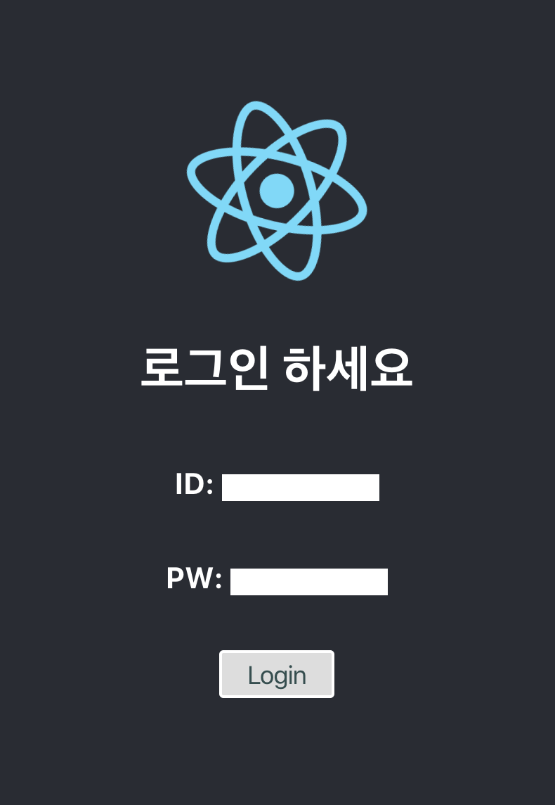
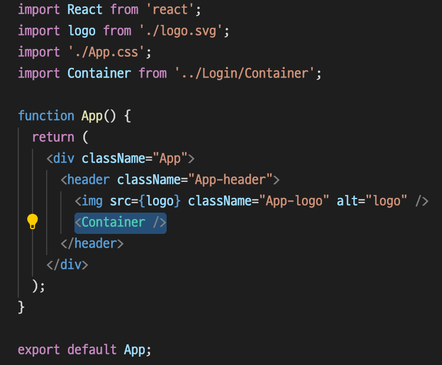

# 웹 모바일 프로젝트 - React 기초



## 0. 목표

- 로그인 & 로그아웃 렌더링 화면 구현 
- SPA(Single Page Application)의 구조 이해
- 반응형 단일 페이지 애플리케이션 구현


## 1. 기술 스택

- JavaScript, React 


## 2. 개발과정

#### 1. NPM 설치 : node.js 공식 홈페이지에 접속하여 설치 파일 다운로드

   ( 다운로드 버전은 안정성과 신뢰도가 높은 LTS 버전 선택을 권장)

   설치 후 버전 확인 

   ```bash
   > npm --version
   ```


#### 2. React 시작하기

   1) npm으로 React App 생성

   ```bash
   > npm install -g create-react-app
   > create-react-app "<PROJECT-NAME>"
   
   > cd "<PROJECT-NAME>"
   > npm start
   ```

   2) yarn 으로 React App 생성

   ```bash
   > yarn init
   > yarn add react react-dom
   
   > npm init
   > npm install --save react react-dom
   ```


#### 3. Component 분리

   

   src 아래 components 폴더 생성 후, 

   App, Login, Logout 기능별 폴더 생성



​	App.js 에 Container 추가

​	- 전달받은 props를 사용하지 않고 아래로 전달하기만 하는 컴포넌트나 자식 컴포넌트가 더 많은 데이터를 필요로 할 때 모든 중간 컴포넌트를 재구성해야하는 컴포넌트들일 경우 도입

​	

#### 4. Container.jsx 파일 생성

   React Hook 사용 -> 존재하는 코드와 함께 나란히 작동. 로직에 기반을 둔 작은 함수로 컴포넌트를 나누어 쓰기 위해 사용함

   

   1) Container 정의

   ```js
   const Container = () => {
      
   }
   export default Container;
   ```

   

   2) 함수 및 State 정의

   ```js
   const [inputValue, setInputValue] = useState('');
   const [isSubmit, setIsSubmit] = useState(false);
   const setSubmitValue = () => {
           setIsSubmit(true);
       }
   const Logout = () => {
           setIsSubmit(false);
       }
   ```

   useState는 state를 함수 컴포넌트 안에서 사용할 수 있게 해줌

   state 변수 선언 (배열을 한꺼번에 정의 가능, 괄호 안은 초기값)

   createState는 한번만 생성되기 때문에 useState로 현재의 값을 줌 (변화 시 re렌더링)

   나머지 on-click할 이벤트는 일반 함수로 정의

   

   3) return (렌더링) 요소 정의

   ```js
   <>
     { isSubmit 
      ? <>
      <h2>{inputValue} 님, 안녕하세요 !</h2>
   
   <ButtonStyled onClick={Logout}> Logout</ButtonStyled>
   </>
   :
     <>
       <h1>로그인 하세요</h1>
   <h3>ID:  <LoginInput inputFn={setInputValue} /></h3>
   <h3>PW:  <input type="password"></input> </h3>
   
     <LoginBtn submitFn={setSubmitValue} />
       </>}
   </>
   ```

   

   <></> : Fragment를 선언하는 문법. 빈 태그와 같은 기능인데 하나의 div 기능

   js의 삼항 연산자를 사용한 렌더링 화면 구성

   로그인의 경우, 로그인 이후 유저의 이름을 보여주기 위해 다음과 같은 코드 구현

   ```js
   <LoginInput inputFn={setInputValue} />
   <LoginBtn submitFn={setSubmitValue} />
   ```

   함수 컴포넌트는 {} 중괄호 직접 사용 가능!

   각각의 중괄호 안의 함수의 이름을 정의해준 것 -> 다른 컴포넌트에서 사용

   

#### 5. 버튼 생성 및 정의

   ```js
   const Btn = (props) => {
       const submit = () => {
           props.submitFn();
       }
   
       return (
           <ButtonStyled onClick={submit}>Login</ButtonStyled>
       )
   }
   export default Btn;
   ```

   Props 를 받고 submit함수를 정의해 값을 저장하게 하는 버튼을 정의

   

   이 때, Btn 스타일도 js 파일(컴포넌트)로 따로 만들어 줌. 후에 다른 버튼도 적용 가능

   ```js
   import styled from 'styled-components';
   
   const ButtonStyled = styled.button`
     color: darkslategray;
     font-size: 1em;
     margin: 1em;
     padding: 0.25em 1em;
     border: 2px solid white;
     border-radius: 3px;
   `;
   
   const ButtonRedStyled = styled.button`
       color: blue;
   `;
   
   export { ButtonStyled, ButtonRedStyled };
   ```

   

#### 6. Input 로직 정의

   ```js
   import React from 'react';
   import { InputStyled } from "./InputStyle";
   
   const Input = (props) => {
       const setInput = (event) => {
           props.inputFn(event.target.value);
       }
   
       return (
           <InputStyled id="loginInput" type="text" onKeyUp={event => setInput(event)} />
           )
   };
   
   export default Input;
   ```

   스타일 된 Input을 keyUp(글자 입력 시)마다 그 값을 props하게 해주는 Input 정의

   이 때 사용한 InputStyle 코드는

   ```js
   import styled from "styled-components";
   
   const InputStyled = styled.input`
       width: '300px';
   `;
   
   export {InputStyled};
   ```

   

## 3. 실행 방법

1) 폴더 위치가 react-login 인지 확인하고

2) 터미널에 npm start